# BIR Compliance Accounting System – Complete System Flowchart

> Paste the Mermaid code block below into any of these tools to view/export:
> - **Mermaid Live Editor**: https://mermaid.live (paste → export as PNG/SVG/PDF)
> - **GitHub**: Any `.md` file with a `mermaid` code block renders automatically
> - **VS Code**: Install "Markdown Preview Mermaid Support" extension

```mermaid
flowchart TB
    %% ── Entry & Auth ──────────────────────────────
    START([User]) --> LOGIN[Login Page]
    LOGIN -->|Authenticated| AUTH{Role-Based<br/>Access Control}
    AUTH -->|Admin| DASH
    AUTH -->|Accountant| DASH
    AUTH -->|Auditor| DASH

    %% ── Dashboard ─────────────────────────────────
    DASH[Dashboard<br/>KPI Cards · Cash-Flow Chart]

    %% ── Module Navigation ─────────────────────────
    DASH --> SETUP_GROUP
    DASH --> OPS_GROUP
    DASH --> ACCTG_GROUP
    DASH --> REPORTS_GROUP
    DASH --> ADMIN_GROUP

    %% ════════════════════════════════════════════════
    %% SETUP MODULES
    %% ════════════════════════════════════════════════
    subgraph SETUP_GROUP[Setup & Master Data]
        direction TB
        COA[Chart of Accounts<br/>Code · Name · Type<br/>Normal Balance · Parent]
        BRANCH[Branches<br/>Code · Name · TIN<br/>Address · Main Flag]
        CUST[Customers<br/>Code · Name · TIN<br/>Contact · Address]
        SUPP[Suppliers<br/>Code · Name · TIN<br/>Contact · Address]
        HR[Human Resources<br/>Employee No · Name<br/>Position · Dept · Rate]
        INV_ITEM[Inventory Items<br/>SKU · Name · Unit<br/>Reorder Level]
    end

    %% ════════════════════════════════════════════════
    %% OPERATIONS MODULES
    %% ════════════════════════════════════════════════
    subgraph OPS_GROUP[Operations]
        direction TB

        subgraph SALES_FLOW[Sales Cycle]
            direction LR
            SO[Sales Order<br/>Create] -->|Confirm| SO_CONF[Confirmed SO]
            SO_CONF -->|Convert| SI[Sales Invoice<br/>Issued]
            SI -->|Collect Payment| CR[Collection Receipt<br/>Cash · Bank · Check · Online]
        end

        subgraph PURCHASE_FLOW[Purchase Cycle]
            direction LR
            PO[Purchase Order<br/>Create] -->|Receive| PO_REC[Received PO]
            PO_REC -->|Convert| BILL[Purchase Bill<br/>Issued]
        end

        subgraph INVENTORY_FLOW[Inventory]
            direction LR
            INV_MOV[Stock Movements<br/>In · Out · Adjust · Transfer]
        end

        subgraph PAYROLL_FLOW[Payroll Processing]
            direction LR
            PP[Payroll Period<br/>Semi-Monthly] --> PR_GEN[Generate Run<br/>SSS · PhilHealth<br/>Pag-IBIG · Tax]
            PR_GEN -->|Approve| PR_APP[Approved Run]
            PR_APP -->|Post| PR_POST[Posted ➜ Journal]
        end

        subgraph BANKING_FLOW[Banking]
            direction LR
            BA[Bank Accounts] --> BT[Bank Transactions<br/>Credit · Debit]
            BT --> BS[Statement Import<br/>CSV]
            BS --> BRECO[Reconciliation<br/>Auto-Match · Manual]
        end
    end

    %% ════════════════════════════════════════════════
    %% ACCOUNTING CORE
    %% ════════════════════════════════════════════════
    subgraph ACCTG_GROUP[Accounting Engine]
        direction TB

        subgraph JE_FLOW[Journal Entries]
            direction LR
            JE_DRAFT[Draft Entry<br/>General · Sales · Purchase<br/>Cash Receipts · Cash Disbursements] -->|Post| JE_POST[Posted Entry]
            JE_POST -->|Event: JournalEntryPosted| LEDGER_POST[Ledger Posting<br/>Listener]
            JE_POST -.->|Reverse| JE_REV[Reversal Entry]
        end

        subgraph EINV_FLOW[E-Invoicing / BIR]
            direction LR
            EINV_D[Draft E-Invoice] -->|Issue| EINV_I[Issued]
            EINV_I -->|Transmit| EINV_T[Transmitted to BIR]
            EINV_I -.->|Cancel| EINV_C[Cancelled]
        end

        LEDGER[General & Subsidiary Ledgers]
    end

    %% ════════════════════════════════════════════════
    %% REPORTS
    %% ════════════════════════════════════════════════
    subgraph REPORTS_GROUP[Financial Reports]
        direction TB
        TB_RPT[Trial Balance]
        BS_RPT[Balance Sheet]
        IS_RPT[Income Statement]
        JB_RPT[Journal Book]
        GL_RPT[General Ledger Book]
        AR_RPT[AR Ledger]
        AP_RPT[AP Ledger]
        CL_RPT[Customer Ledger]
        SL_RPT[Supplier Ledger]
    end

    %% ════════════════════════════════════════════════
    %% ADMIN & SYSTEM
    %% ════════════════════════════════════════════════
    subgraph ADMIN_GROUP[Administration]
        direction TB
        USERS[User Management<br/>Create · List]
        UACCESS[User Access Control<br/>Module Permissions]
        SYSINFO[System Info<br/>Company Profile]
        BACKUP[Backups<br/>Create · Restore]
        AUDIT[Audit Trail<br/>Logs · Activity]
        EXPORT[Export Excel<br/>All Modules]
    end

    %% ══ Cross-Module Data Flows ═══════════════════
    SI -->|Auto Journal| JE_DRAFT
    CR -->|Auto Journal| JE_DRAFT
    BILL -->|Auto Journal| JE_DRAFT
    PR_POST --> JE_DRAFT
    LEDGER_POST --> LEDGER
    LEDGER --> REPORTS_GROUP

    COA -.->|Account Tree| JE_DRAFT
    COA -.->|Account Tree| LEDGER
    COA -.->|Account Tree| REPORTS_GROUP

    CUST -.-> SO
    CUST -.-> CR
    SUPP -.-> PO
    BRANCH -.-> SO
    BRANCH -.-> PO
    HR -.-> PP
    INV_ITEM -.-> INV_MOV
    SI -.->|BIR Compliance| EINV_D
    AUDIT -.->|AuditObserver| OPS_GROUP

    %% ── Styling ───────────────────────────────────
    classDef setup fill:#e0f2fe,stroke:#0284c7,color:#0c4a6e
    classDef ops fill:#fef3c7,stroke:#d97706,color:#78350f
    classDef acctg fill:#d1fae5,stroke:#059669,color:#064e3b
    classDef rpt fill:#ede9fe,stroke:#7c3aed,color:#4c1d95
    classDef admin fill:#fce7f3,stroke:#db2777,color:#831843
    classDef entry fill:#f1f5f9,stroke:#475569,color:#1e293b

    class COA,BRANCH,CUST,SUPP,HR,INV_ITEM setup
    class SO,SO_CONF,SI,CR,PO,PO_REC,BILL,INV_MOV,PP,PR_GEN,PR_APP,PR_POST,BA,BT,BS,BRECO ops
    class JE_DRAFT,JE_POST,JE_REV,LEDGER_POST,LEDGER,EINV_D,EINV_I,EINV_T,EINV_C acctg
    class TB_RPT,BS_RPT,IS_RPT,JB_RPT,GL_RPT,AR_RPT,AP_RPT,CL_RPT,SL_RPT rpt
    class USERS,UACCESS,SYSINFO,BACKUP,AUDIT,EXPORT admin
    class START,LOGIN,AUTH,DASH entry
```

